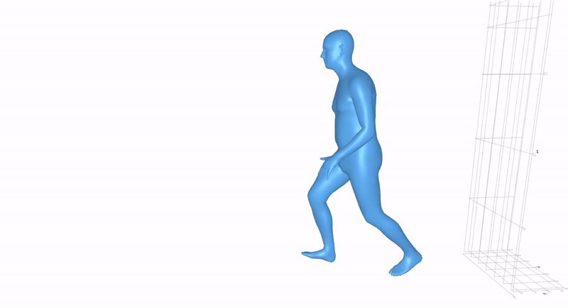

# SMPL.jl

Julia implementation of the SMPL family of parametric human body models.



Supports **SMPL** (Loper et al., 2015), **SMPL-X** (Pavlakos et al., 2019), and **SUPR** (Osman et al., 2022). Features GPU acceleration, interactive visualization, motion loading, and static compilation to a standalone binary.

---

## Table of Contents

1. [Installation](#installation)
2. [Model Download](#model-download)
3. [Basic Usage](#basic-usage)
4. [Loading Motion Sequences](#loading-motion-sequences)
5. [Visualization](#visualization)
6. [GPU Acceleration](#gpu-acceleration)
7. [Pivot Joint Visualization](#pivot-joint-visualization)
8. [Static Compilation](#static-compilation)
9. [Testing](#testing)
10. [Benchmarking](#benchmarking)
11. [Model Reference](#model-reference)

---

## Installation

```julia
# In the Julia REPL:
] add https://github.com/nitin-ppnp/SMPL.jl
```

---

## Model Download

The first time you create a model struct, SMPL.jl will download the model weights automatically via **DataDeps.jl**. You need to register at each model's website first:

| Model | Registration URL |
|-------|-----------------|
| SMPL  | https://smpl.is.tue.mpg.de/ |
| SMPL-X | https://smpl-x.is.tue.mpg.de/ |
| SUPR  | https://supr.is.tue.mpg.de/ |

On the first run, Julia will prompt for your credentials. To avoid re-entering them, create a `credentials.toml` file in the repo root (copy from `credentials.toml.example`):

```toml
[smpl]
username = "your@email.com"
password = "yourpassword"

[smplx]
username = "your@email.com"
password = "yourpassword"

[supr]
username = "your@email.com"
password = "yourpassword"
```

---

## Basic Usage

### Step 1 — Load a model

```julia
using SMPL

# Gender variants: create_smpl_neutral / create_smpl_female / create_smpl_male
# Same pattern for SMPLX and SUPR
smpl  = create_smpl_neutral()
smplx = create_smplx_neutral()
supr  = create_supr_neutral()
```

### Step 2 — Run the forward pass

```julia
# SMPL: 10 shape params, 72 pose params (24 joints × 3)
betas = zeros(Float32, 10)
poses = zeros(Float32, 72)
out   = smpl_lbs(smpl, betas, poses)

# SMPL-X: 10 shape params, 165 pose params (55 joints × 3)
out_x = smpl_lbs(smplx, zeros(Float32, 10), zeros(Float32, 165))

# SUPR: 10 shape params, 225 pose params (75 joints × 3)
# Note: AMASS motion files store 228 = 76×3 (extra joint); smpl_lbs accepts both.
out_s = smpl_lbs(supr, zeros(Float32, 10), zeros(Float32, 225))
```

### Step 3 — Access the output

`smpl_lbs` returns an `SMPLOutput` struct (not a Dict):

```julia
out.vertices   # (N_v, 3) Float32 — mesh vertices in world space
out.joints     # (N_j, 3) Float32 — joint positions in world space
out.v_shaped   # (N_v, 3) — vertices after shape blend (before pose)
out.v_posed    # (N_v, 3) — vertices after pose blend (before skinning)
out.faces      # (N_f, 3) UInt32  — triangle indices (1-indexed)
```

### Step 4 — Apply translation and custom shapes

```julia
# Custom body shape (tall, wide person)
betas = Float32[2.0, 1.0, 0.0, 0.0, 0.0, 0.0, 0.0, 0.0, 0.0, 0.0]

# Translation vector
trans = Float32[0.0, 0.0, 1.0]   # move 1 m along Z

out = smpl_lbs(smpl, betas, poses, trans)
```

---

## Loading Motion Sequences

SMPL.jl auto-detects three motion file formats:

| Format | Extension | Description |
|--------|-----------|-------------|
| smplcodec v1 | `.smpl` | Single body, Y-up world |
| smplcodec v2 | `.smpl` | SMPL-X with separate hand/head poses, Z-up |
| AMASS | `.npz` | Large-scale MoCap dataset, Z-up |

### Load a motion file

```julia
using SMPL

# smplcodec .smpl file (format auto-detected)
seq = load_motion("recording.smpl")

# AMASS .npz file
seq = load_motion("/path/to/AMASS/ACCAD/Female1Walking_c3d/walk.npz")

# Y-up smplcodec v2 dataset — override the up-axis explicitly
seq = load_motion("walk_yup.smpl"; up=:y)
```

### Inspect the sequence

```julia
seq.poses       # (N_frames, pose_dim) — flat pose parameters
seq.betas       # (N_b,)               — body shape parameters
seq.trans       # (N_frames, 3)        — root translation
seq.fps         # Float32              — frame rate
seq.model_type  # :smpl / :smplx / :supr
seq.gender      # :neutral / :male / :female
seq.up          # :y or :z — which world axis is "up"
```

### Run the forward pass on one frame

```julia
model = create_smplx_neutral()
seq   = load_motion("recording.smpl")

frame = 42
out = smpl_lbs(model,
               seq.betas,
               seq.poses[frame, :],
               seq.trans[frame, :])

out.vertices   # (10475, 3) world-space mesh for frame 42
```

---

## Visualization

Visualization is a **weak dependency** — load any Makie backend to activate it.

- **Interactive player** → `GLMakie` or `WGLMakie`
- **Headless rendering** → `CairoMakie`

### Interactive player

```julia
using SMPL, GLMakie

model = create_smplx_neutral()
seq   = load_motion("recording.smpl")

# Opens a window with play/pause, frame slider, speed control
viz_motion(model, seq)

# Custom camera
viz_motion(model, seq;
           camera_eye    = Vec3f(0, -3, 1.5),
           camera_lookat = Vec3f(0,  0, 1.0),
           camera_fov    = 35f0)
```

### Multiple sequences side by side

```julia
seq_a = load_motion("walk.smpl")
seq_b = load_motion("run.smpl")

# Side-by-side view, synchronized playback
viz_motions(model, [seq_a, seq_b]; layout=:sidebyside, labels=["Walk", "Run"])

# Overlay both in one scene
viz_motions(model, [seq_a, seq_b]; layout=:overlay)
```

### Headless video rendering

```julia
using SMPL, CairoMakie

model = create_smplx_neutral()
seq   = load_motion("recording.smpl")

# Render to MP4
record_motion(model, seq, "output.mp4"; resolution=(1280, 720))

# Render a single frame to PNG
render_frame(model, seq, 42, "frame_042.png"; resolution=(1280, 720))
```

### Pre-baking vertices for export

```julia
# Compute all frames at once: returns (N_v, 3, N_frames) Array
verts = bake_motion(model, seq)
```

### Reusable camera kwargs

```julia
cam = (
    camera_eye    = Vec3f(2, -2, 1.5),
    camera_lookat = Vec3f(0,  0, 1.0),
    camera_upvector = Vec3f(0, 0, 1),
    camera_fov    = 40f0,
)

viz_motion(model, seq; cam...)
record_motion(model, seq, "output.mp4"; cam...)
```

---

## GPU Acceleration

GPU support is a **weak dependency** via `Adapt.jl`. Move the model to GPU; `smpl_lbs` then runs entirely on device.

```julia
using SMPL, Adapt, CUDA

model = create_smpl_neutral()

# Move all model arrays to GPU (parents and faces stay on CPU)
gpu_model = Adapt.adapt(CuArray, model)

# Forward pass on GPU — same API
betas = CUDA.zeros(Float32, 10)
poses = CUDA.zeros(Float32, 72)
out   = smpl_lbs(gpu_model, betas, poses)

out.vertices   # CuMatrix{Float32} on GPU
```

---

## Pivot Joint Visualization

When pivot joint probability scores are available, they can be overlaid on the body mesh using a `:hot` colormap.

### Load pivot labels alongside a motion

```julia
seq = load_motion("walk.smpl";
                  pivot_labels_path = "walk_labels.npy")

seq.pivot_joints   # (N_frames, 23) Matrix{Float32} — scores per joint per frame
```

### Visualize pivot joints interactively

```julia
using SMPL, GLMakie

model = create_smplx_neutral()
seq   = load_motion("walk.smpl"; pivot_labels_path="walk_labels.npy")

# Show only the highest-scoring joint per frame
viz_motion(model, seq; pivot_mode=:max)

# Show all joints with score ≥ threshold
viz_motion(model, seq; pivot_mode=:threshold, pivot_threshold=0.5f0)
```

### Render pivot visualization headlessly

```julia
using SMPL, CairoMakie

record_motion(model, seq, "pivot_max.mp4";
              resolution  = (960, 720),
              pivot_mode  = :max)

render_frame(model, seq, 42, "pivot_frame.png";
             pivot_mode      = :threshold,
             pivot_threshold = 0.5f0)
```

### Load pivot labels separately

```julia
labels = load_pivot_labels("walk_labels.npy")   # (N_frames, 23) Matrix{Float32}
```

---

## Static Compilation

SMPL.jl ships a GC-free LBS pipeline for compiling to a standalone native binary (no Julia runtime required). This uses JuliaC's `trim_mode="unsafe"` via `StaticArrays` and `MallocMatrix`.

### Step 1 — Convert your NPZ model to `.smplbin`

```bash
julia scripts/convert_model.jl /path/to/smpl_neutral.npz model.smplbin
```

### Step 2 — Build the binary

```bash
julia compile.jl
# Output: build/bin/smpl.exe  (Windows)  or  build/bin/smpl  (Linux/macOS)
```

### Step 3 — Run the binary

```bash
./build/bin/smpl model.smplbin
```

The static binary accepts `.smplbin` model files and runs the full LBS pipeline with no Julia overhead. It is suitable for embedding in applications that cannot carry a Julia runtime.

---

## Testing

```bash
# Full test suite (SMPL and SMPLX reference comparisons + static IO test)
julia --project=. -e 'using Pkg; Pkg.test()'

# Skip the static IO test (if models not yet downloaded)
SMPL_TEST_STATIC=false julia --project=. -e 'using Pkg; Pkg.test()'

# Static binary roundtrip test only (no JuliaC required, ~seconds)
julia --project=. test/test_static_io.jl

# Full compile → run → verify test (requires JuliaC, ~10 min)
SMPL_TEST_COMPILE=true julia --project=. test/test_static_compile.jl
```

Tests compare `out.vertices` and `out.joints` against reference NPZ files with **1e-5 tolerance**.

---

## Benchmarking

An isolated benchmark suite lives in `bench/`:

```bash
# Install bench dependencies once
julia --project=bench/ -e 'using Pkg; Pkg.instantiate()'

# Run all benchmarks
julia --project=bench/ bench/run_benchmarks.jl
```

Key environment variables:

| Variable | Default | Description |
|----------|---------|-------------|
| `SMPL_BENCH_MODEL` | `smpl_female` | Which model to benchmark |
| `SMPL_BENCH_GPU` | `auto` | `true` / `false` / `auto` |
| `SMPL_BENCH_STATIC` | `auto` | Include static binary benchmark |
| `SMPL_BENCH_STATIC_MODEL` | _(auto)_ | Path to `.smplbin` file |
| `SMPL_BENCH_SECONDS` | `5` | Seconds per benchmark |

---

## Model Reference

| Model | Joints | Vertices | Pose dim | Shape dim |
|-------|--------|----------|----------|-----------|
| SMPL  | 24     | 6890     | 72       | 10        |
| SMPL-X | 55    | 10475    | 165      | 10        |
| SUPR  | 75     | 10475    | 225 (228 in AMASS) | 10 |

### Available constructors

```julia
# SMPL
create_smpl_neutral()
create_smpl_female()
create_smpl_male()

# SMPL-X
create_smplx_neutral()
create_smplx_female()
create_smplx_male()

# SUPR
create_supr_neutral()
create_supr_female()
create_supr_male()
```
